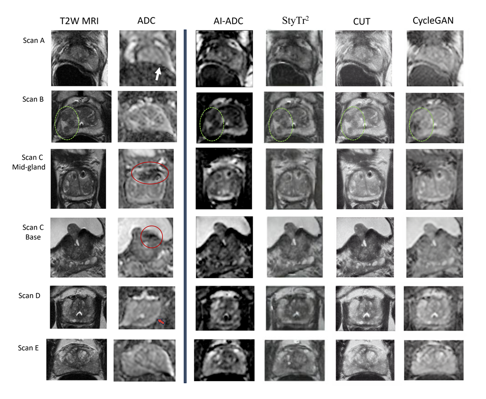

# AI-ADC: Channel and Spatial Attention based Contrastive Learning to Generate ADC maps from T2W MRI for Prostate Cancer Detection
<p align="center">
 
</p>

## AI-ADC train test dataset

<p align="center">
  
</p>

## Getting Started

### 1. Installation

#### Clone AI-ADC Repository

```bash
cd ~
git clone https://github.com/Kutsev-Ozyoruk/AI-ADC
cd AI-ADC
```

#### Prerequisities

You will need to build the Endo-SFMLearner environment by following commend:

```bash
pip3 install -r requirements.txt
```

### 2. Qualitative Evaluations

#### 2.1 Qualitative Results on NCI In-house Dataset:

<p align="center">
 
</p>

#### 2.2 Qualitative Results on ProstateX:

<p align="center">
 
</p>
